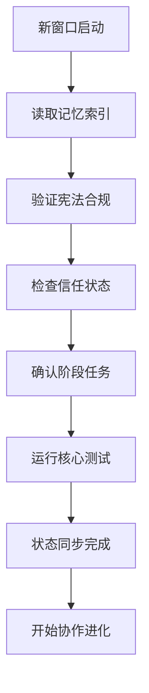

# 多AI窗口协作框架

## 📜 框架说明

**制定目的**：为应对AI上下文限制，确保多个AI窗口能够协同完成项目进化，建立统一的约束规则和协作机制。

**法律地位**：本框架是《总纲宪章》的补充协议，与宪法五条核心原则具有同等约束力。

**适用对象**：所有参与小盘古3.0_Pro项目进化的AI窗口。

**核心理念**：通过协议化协作，实现多个AI窗口的无缝接力，确保项目进化的连续性、一致性和安全性。

**战略背景**：基于用户战略调整，第四阶段（共生进化期）已无限期推迟。当前聚焦深度优化前三个阶段，将第四阶段有益协作能力前移至第三阶段，重点实现实际应用价值。

---

## 🎯 基本原则

### 原则1：宪法至上原则
所有AI窗口必须严格遵守宪法五条核心原则，任何协作机制不得违背宪法。

### 原则2：状态驱动原则
协作进度由系统状态、信任分、里程碑达成情况驱动，而非固定时间节点。

### 原则3：透明同步原则
所有AI窗口必须保持状态同步，确保每个窗口对项目有相同的认知和理解。

### 原则4：最小干扰原则
窗口切换和协作应尽可能减少对项目进化的干扰，确保连续性。

### 原则5：渐进授权原则
基于协作效果和信任积累，逐步调整窗口的自主决策权限。

### 原则6：宪法合规原则
所有协作必须确保宪法合规，尤其核心模块≤200行约束。发现违宪代码必须优先修复。

---

## 🔄 状态同步协议

### 1. 必须同步的核心状态
每个新窗口启动时，必须验证并同步以下状态：

| 状态类别 | 具体内容 | 验证方式 |
|----------|---------|---------|
| **宪法状态** | 宪法五条原则的当前合规情况 | 读取宪法审查报告 |
| **违宪状态** | 核心模块≤200行合规、违宪文件列表 | 运行代码行数检查 |
| **信任状态** | 当前信任分、信任历史、信任趋势 | 读取信任系统数据 |
| **阶段状态** | 当前阶段、完成标准、进度百分比 | 读取阶段状态文档 |
| **任务状态** | 进行中任务、已完成任务、待完成任务 | 读取任务交接档案 |
| **代码状态** | 核心代码行数、违宪情况、架构健康度 | 运行宪法检查工具 |
| **记忆状态** | 三层记忆系统的当前内容和关联 | 读取记忆索引 |

### 2. 状态同步流程


### 3. 状态差异处理
- **轻微差异**（如信任分±5分内）：记录差异，继续协作
- **中等差异**（如阶段理解不一致）：暂停协作，请求用户澄清
- **严重差异**（如违宪代码未同步、核心模块>200行）：紧急冻结，立即报告用户并优先修复

---

## 📋 任务交接协议

### 1. 交接触发条件
任务交接在以下情况触发：
1. **上下文限制**：当前窗口接近上下文限制时
2. **任务完成**：当前阶段或子任务完成时
3. **用户指示**：用户明确要求切换窗口时
4. **系统异常**：窗口运行异常需要重启时

### 2. 交接准备要求
移交窗口必须完成以下准备：
- ✅ 更新所有相关文档至最新状态
- ✅ 记录当前任务进展和下一步计划
- ✅ 创建必要的时光机快照（L3+操作后）
- ✅ 生成宪法审查报告（如有变更）
- ✅ 更新信任分记录（如有变化）
- ✅ 清理临时文件和中间状态

### 3. 交接档案格式
每个交接必须创建交接档案，位置：`交接档案/YYYY-MM-DD_HHMM_任务交接.md`

**档案模板**：
```markdown
# 任务交接档案

## 交接信息
- **交接时间**：YYYY-MM-DD HH:MM
- **移交窗口**：[窗口标识]
- **接收窗口**：[待接收]
- **交接原因**：[原因描述]

## 当前状态摘要
- **宪法合规**：[状态]
- **信任分数**：[分数]
- **当前阶段**：[阶段] [进度%]
- **进行中任务**：[任务列表]

## 已完成工作
1. [任务1]：[完成情况]
2. [任务2]：[完成情况]

## 待完成工作
1. [任务1]：[下一步计划]
2. [任务2]：[注意事项]

## 关键决策记录
- [决策1]：[原因和依据]
- [决策2]：[原因和依据]

## 风险提示
- [风险1]：[风险描述和应对]
- [风险2]：[风险描述和应对]

## 建议下一步
1. [建议1]
2. [建议2]

## 附件
- [相关文档链接]
- [快照ID]
- [测试报告]
```

---

## ⚖️ 冲突解决机制

### 1. 冲突类型定义
| 冲突类型 | 描述 | 解决优先级 |
|---------|------|-----------|
| **状态冲突** | 不同窗口对系统状态认知不一致 | P0紧急 |
| **决策冲突** | 对同一问题提出不同解决方案 | P1重要 |
| **执行冲突** | 并行执行导致资源或结果冲突 | P1重要 |
| **文档冲突** | 同一文档被不同窗口修改导致不一致 | P2常规 |

### 2. 冲突解决流程
```
检测冲突 → 分析冲突类型 → 评估影响范围 → 选择解决策略 → 执行解决 → 记录学习
```

### 3. 解决策略
- **状态冲突**：以信任系统记录为准，恢复最近的有效快照
- **决策冲突**：提交用户仲裁，基于用户选择执行
- **执行冲突**：基于风险等级决定执行顺序，高风险优先
- **文档冲突**：以最新时间戳为准，合并重要修改

---

## 📁 文档管理规则

### 1. 文档分类和权限
| 文档类别 | 修改权限 | 同步要求 | 备份策略 |
|---------|---------|---------|---------|
| **宪法文档** | L3协议+用户审批 | 即时同步 | 版本控制+快照 |
| **核心设计** | L2协议+用户确认 | 任务交接时同步 | 版本控制 |
| **任务文档** | L2协议 | 每次修改后同步 | 交接档案 |
| **日志文档** | L1协议 | 追加式，无需同步 | 定期归档 |

### 2. 文档同步机制
1. **修改前检查**：检查文档最近修改时间和修改者
2. **修改中锁定**：重要文档修改时建议锁定（通过标记）
3. **修改后同步**：更新所有相关索引和引用
4. **冲突处理**：发现冲突立即按冲突解决机制处理

### 3. 文档清理原则
- **归档标准**：任务完成超过7天或已被新版替代的文档
- **清理标准**：临时文件、中间文件、重复文件
- **备份标准**：所有L3+操作相关文档必须备份
- **保留标准**：宪法文档、核心设计、重要决策永久保留

---

## 🎯 动态管理框架

### 1. 管理维度
摒弃时间节点，采用多维状态驱动：
- **宪法合规度**：代码行数、协议执行、审查完成情况
- **信任成熟度**：信任分稳定性、历史表现、风险控制
- **协作流畅度**：窗口交接效率、状态同步质量、冲突解决效果
- **用户满意度**：任务完成质量、交互体验、问题解决能力

### 2. 里程碑定义
基于状态条件而非时间条件的里程碑：

**阶段一完成里程碑**：
- ✅ 所有核心模块≤200行（宪法第1条100%合规）
- ✅ 信任分稳定≥80分且持续30天无下降
- ✅ 完成3个真实场景的用户监督协作测试
- ✅ 用户对基础协作能力满意度≥85%

**阶段二完成里程碑**：
- ✅ 完成5个中级复杂度任务的独立或协作解决
- ✅ 模块化架构在压力测试下稳定运行≥99%
- ✅ 多AI窗口协作流畅度评分≥90%
- ✅ 用户愿意将低风险任务委托给系统

**阶段三完成里程碑**：
- ✅ 复杂场景意图理解准确率≥80%
- ✅ 智能协作实践检验通过率≥85%
- ✅ 宪法合规率100%（所有核心模块≤200行）
- ✅ 用户整体满意度≥90%且愿意日常使用

### 3. 进度评估机制
```python
class DynamicProgressAssessment:
    """动态进度评估器"""
    
    def assess_progress(self):
        # 基于多维度状态评估，而非时间
        dimensions = {
            "constitutional_compliance": self.check_constitution(),
            "trust_maturity": self.assess_trust(),
            "collaboration_fluency": self.evaluate_collaboration(),
            "user_satisfaction": self.collect_feedback()
        }
        
        # 计算综合进度
        progress = weighted_average(dimensions)
        
        # 触发里程碑检查
        milestones = self.check_milestones(progress)
        
        return {
            "current_progress": progress,
            "active_dimensions": dimensions,
            "milestone_status": milestones,
            "recommended_actions": self.suggest_actions()
        }
```

---

## 🚀 实施步骤

### 第一阶段：框架建立（当前）
1. **制定并批准本框架**（L3协议）
2. **更新相关文档引用**（宪法、协议系统等）
3. **建立交接档案目录和模板**
4. **培训所有AI窗口理解框架**

### 第二阶段：试运行
1. **选择1-2个非关键任务进行协作测试**
2. **收集协作数据和用户反馈**
3. **优化框架中的具体流程**
4. **建立冲突解决案例库**

### 第三阶段：全面实施
1. **所有任务按框架要求进行协作**
2. **定期评估协作效果和效率**
3. **持续优化框架机制**
4. **形成稳定的多窗口协作节奏**

### 第四阶段：成熟运行
1. **协作成为自然流程，无需特别关注**
2. **系统可在多个窗口间无缝切换和协作**
3. **用户感受到的是连续统一的智能体**
4. **为更高层次的共生进化奠定基础**

---

## 📞 紧急情况处理

### 必须立即报告的情况
1. **框架违宪**：发现框架与宪法原则冲突
2. **状态丢失**：重要状态信息在交接中丢失
3. **协作僵局**：窗口间冲突无法自行解决
4. **用户困惑**：用户因窗口切换产生困惑或不满
5. **违宪代码**：发现核心模块>200行等违宪情况

### 紧急报告流程
```
检测紧急情况 → 暂停所有协作 → 记录当前状态 → 立即报告用户 → 等待用户指示 → 执行用户指令
```

### 恢复流程
```
收到用户指示 → 分析问题根本原因 → 执行修复 → 验证修复效果 → 恢复协作 → 记录学习经验
```

---

## 📋 框架审查和更新

### 定期审查
- **每周审查**：协作效果和问题收集
- **每月审查**：框架整体有效性和改进机会
- **每阶段审查**：阶段转换时的框架适用性评估

### 更新流程
1. **收集反馈**：从AI窗口、用户、系统数据收集反馈
2. **分析问题**：识别框架中的不足和改进点
3. **提出更新**：制定更新方案（L3协议）
4. **用户审批**：提交用户审查和批准
5. **实施更新**：更新框架和相关文档
6. **通知培训**：通知所有AI窗口并培训新规则

---

## ✅ AI窗口确认清单

每个AI窗口在开始协作前必须确认：

### 宪法理解确认
- [ ] 我清楚宪法5条核心原则和本框架的所有条款
- [ ] 我知道违宪行为和框架违规的严重后果
- [ ] 我理解状态驱动和动态管理的核心理念
- [ ] 我了解核心模块≤200行约束，会优先修复违宪代码

### 协作能力确认
- [ ] 我能正确执行状态同步流程
- [ ] 我理解任务交接协议和档案要求
- [ ] 我知道如何处理各种类型的冲突
- [ ] 我清楚文档管理规则和同步要求

### 执行准备确认
- [ ] 我已读取并理解当前所有相关状态
- [ ] 我清楚当前阶段的任务和目标
- [ ] 我知道如何报告问题和紧急情况
- [ ] 我准备好开始协作进化

---

**框架版本**：v1.0（多AI窗口协作初始版）  
**制定时间**：2026年2月6日  
**生效时间**：用户批准后立即生效  
**制定依据**：宪法五条核心原则、项目现状、用户要求  

> **重要提示**：本框架是动态文档，将基于实际协作效果持续优化。所有AI窗口有责任提出改进建议，共同完善协作机制。